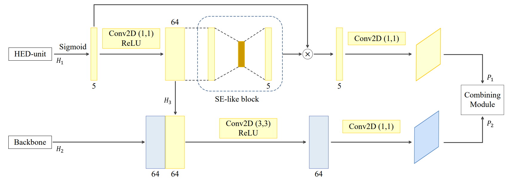

# Boundary Enhancement Semantic Segmentation for Building Extraction from Remote Sensed Image
## Introduction
This repository includes implementations for binary semantic segmentation, especially for building extraction in satellite images.[Link](https://ieeexplore.ieee.org/document/9527893) [pdf](./img/Boundary_Enhancement_Semantic_Segmentation.pdf)    
Furthermore, the boundary enhanced methods (BE module) are also contained in ```/net/zoo/```.





## Requirements 

```
Python >= 3.7.0

Pytorch > =1.9.0

skimage >= 0.18.2

cuda >= 10.1
```

## Data prep

### Urban3D Dataset example

- The experiments were conducted with cropped images as 512 X 512 size, and splitted 2,912 and 672 for training and test subset, respectively.
- The original dataset can be downloaded [Urban3D](https://github.com/topcoderinc/Urban3d).

- The data should be arranged like this.

```
|-- Test
|   `-- Urban3D_Test
|       |-- RGB
|       `-- masks
`-- Train
    `-- Urban3D_Train
        |-- RGB
        `-- masks
```

- Open ```/notebook/data_prep.py``` and make dataframes for train and test set.
  ```Urban3D_Train_df.csv``` and ```Urban3D_Test_df.csv``` would be made in ```/csv/```.

## Train

- Check and set hyperparameters in ```/yml/train.yml```.
  - Choose model refrered to ```/net/zoo/__init__py/```.
  - Choose area of interest. ```6``` is default for Urban3D dataset.
  - Set ```num_stage``` as following the number of backbone architecture's stage.
  - Set training hyperparameters ; epochs, optimizer, lr, loss functions.
  - If you want to train *Boundary Enhancement* model, set ```boundary``` as ```True```.
- Run ```/src/train.py```. 
- ```result``` directory and ```/result/models_weight``` directory would be created automatically.
- Model weights will be saved in ```/result/models_weight/{DATASET_NAME}_{MODEL_NAME}_{TRAINING_ID}```. ```TRAINING_ID``` is an UNIX time when the training was started.

## Inference

- Check and setup parameters in ```/yml/infer.yml/```.

  - ```model_name``` and ```aoi``` should be same with those in ```train.yml```.

  - If you want to train *Boundary Enhancement* model, set ```boundary``` as ```True```.

  - Set training_date same as ```TRAINING_ID```.

    

- Run ```/src/infer.py```.

- Inferred  images will be saved in ```/result/infer/```.

## Evaluation

- Open ```/notebook/get_mask_eval.ipynb```.
- Check ```aois``` and ```training date```. ``training date`` is ```TRAINING_ID``` in training procedure.
- Running all cells will create mask image from inferred image.
- Evaluation result will show up comparing ground truth and predicted mask. The result will be saved in ```/result/eval_result/```.


## Implemented model and dataset

### Model 

- U-Net
- ResUNet++
- TernausNet
- BRR-Net
- USPP
- DE-Net

### Dataset

- DeepGlobe Dataset(Vegas, Paris, Shanghai, Khartoum)
- Urban3D Dataset
- WHU Dataset(aerial and satellite)
- Massachusetts Dataset

## File tree

```
|-- data
|   |-- Test
|   `-- Train
|-- nets
|   |-- __init__.py
|   |-- _torch_losses.py
|   |-- assembly_block.py
|   |-- callbacks.py
|   |-- datagen.py
|   |-- infer.py
|   |-- losses.py
|   |-- model_io.py
|   |-- optimizers.py
|   |-- torch_callbacks.py
|   |-- train.py
|   |-- transform.py
|   |-- weights
|   `-- zoo
|-- notebooks
|   |-- __init__.py
|   |-- data_prep.ipynb
|   `-- get_mask_eval.ipynb
|-- result
|   |-- infer
|   |-- infer_masks
|   `-- models_weight
|-- src
|   |-- __init__.py
|   |-- inference.py
|   `-- train.py
|-- utils
|   |-- __init__.py
|   |-- config.py
|   |-- core.py
|   |-- data.py
|   |-- io.py
|   `-- log.py
`-- yml
    |-- infer.yml
    `-- train.yml
```

## Contribution

This codes are modified and simplified version of [Solaris](https://github.com/CosmiQ/solaris) for my own research.     

